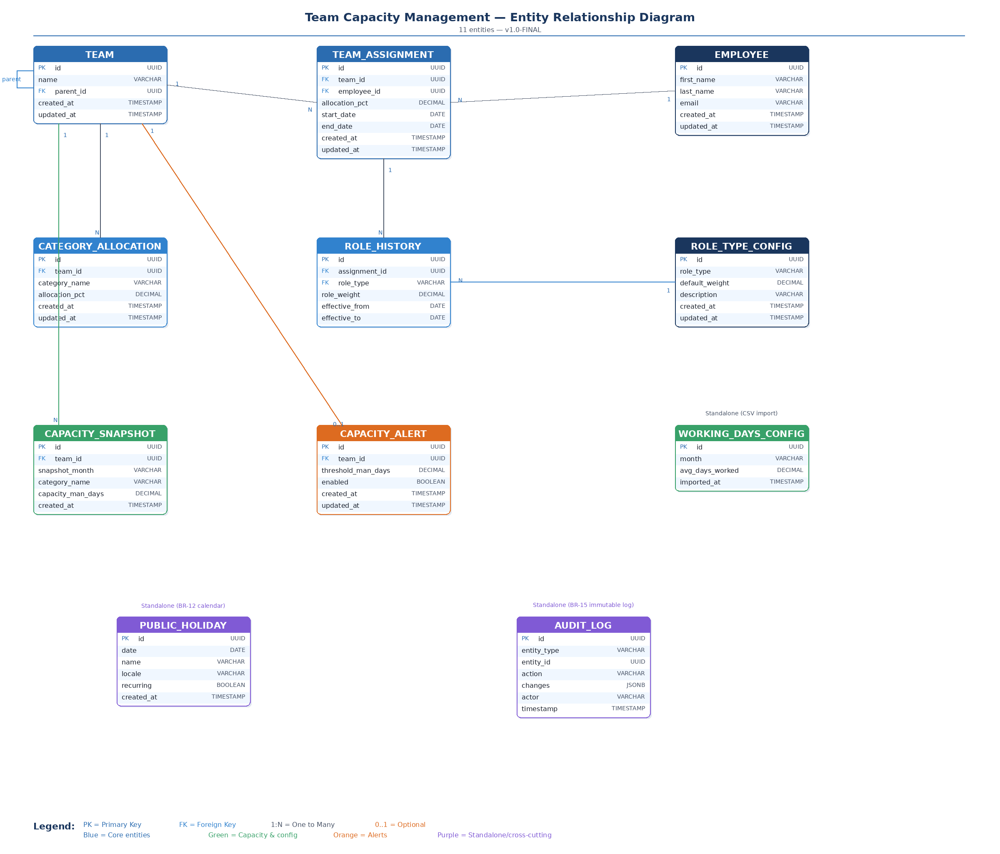
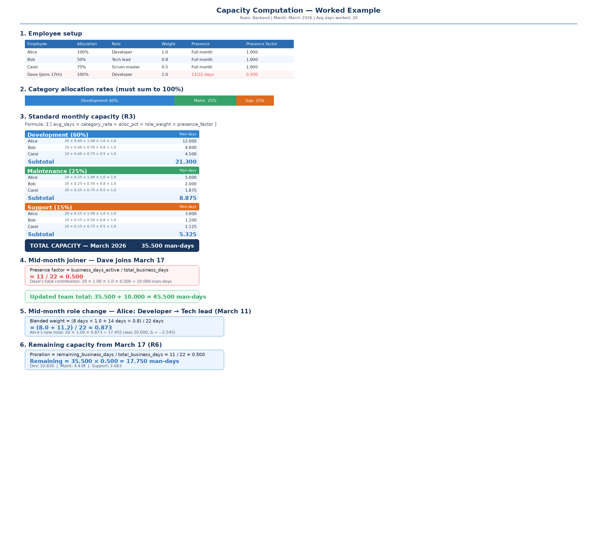

# Team Capacity Management ? Business Requirements Specification

**Version:** 1.0-DRAFT  
**Date:** 2026-03-21  
**Status:** Awaiting validation before code generation

---

## Table of Contents

1. [Restructured Prompt](#1-restructured-prompt)
2. [Glossary](#2-glossary)
3. [Data Model](#3-data-model)
4. [Business Requirements](#4-business-requirements)
   - BR-01 Team Management
   - BR-02 Employee Management
   - BR-03 Team Assignment & Role Management
   - BR-04 Capacity Allocation by Category
   - BR-05 Capacity Computation
   - BR-06 Monthly Capacity Snapshot & Comparison
   - BR-07 Remaining Capacity as of a Given Date
   - BR-08 CSV Import ? Average Working Days
   - BR-09 Role Type Configuration
   - BR-10 Sub-Team Capacity Rollup
   - BR-11 Capacity Forecasting (What-If Simulation)
   - BR-12 Business Day Calendar
   - BR-13 Capacity Alerts
   - BR-14 Multi-Month Comparison
   - BR-15 Audit Trail
5. [Computation Examples](#5-computation-examples)
6. [Out of Scope](#6-out-of-scope)
7. [Proposed Improvements](#7-proposed-improvements)
8. [Technology Recommendation](#8-technology-recommendation)

---

## 1. Restructured Prompt

Below is your original prompt rewritten for clarity, removing ambiguities and structuring the requirements into discrete concerns. **Please validate this before we proceed to code generation.**

> ### Objective
>
> Build a web application that allows a **manager** to manage the **capacity** of their team members across teams, sub-teams, roles, and work categories.
>
> ### Domain Entities
>
> 1. **Team** ? A named organizational unit. A team can have zero or more **sub-teams** (tree structure, depth = 2: team ? sub-team). Each team defines **category allocations** that sum to 100 %.
> 2. **Employee** ? A person who can belong to **one or more teams** simultaneously. Each assignment has a **start date**, an **end date** (nullable = still active), and a **role type**.
> 3. **Role Type** ? A label attached to an employee within a specific team (e.g., Developer, Tech Lead, Scrum Master). The role type may change over time within the same team assignment (history must be kept). The role type influences the **effective allocation rate** used in capacity computation.
> 4. **Category** ? A work category defined at the team level (e.g., Development, Maintenance, Support). Each category has an **allocation rate** expressed as a percentage. All category allocation rates for a team must sum to exactly 100 %.
>
> ### Core Rules
>
> | Rule | Description |
> |------|-------------|
> | **R1 ? 100 % employee cap** | The sum of an employee's allocation percentages across all teams must never exceed 100 % at any point in time. A global check must enforce this on every mutation (assign, update, remove). |
> | **R2 ? 100 % category sum** | For each team, the sum of category allocation rates must equal exactly 100 %. |
> | **R3 ? Capacity formula** | `Capacity(team, category, month) = ?(employee_i) [ avg_days_worked(month) × category_rate × employee_allocation × role_weight(employee_i) ]` |
> | **R4 ? Monthly snapshot** | At the beginning of each month, the system must store a snapshot of the computed capacity (total and per category) for each team so it can be compared with previous months. |
> | **R5 ? On-demand recompute** | Whenever a team mutation occurs (add/remove employee, role change, allocation change), the system must recompute the current capacity. |
> | **R6 ? Remaining capacity** | Given an arbitrary date within a month, the system must compute the remaining capacity from that date until month-end, prorated from the monthly capacity. |
>
> ### Input Data
>
> - A **CSV file** with two columns: `month` (YYYY-MM) and `avg_days_worked` (decimal). This provides the average number of days worked per employee per month for the previous year.
>
> ### Functional Scope
>
> | Function | Details |
> |----------|---------|
> | CRUD Teams | Create, read, update, delete teams and sub-teams |
> | CRUD Employees | Create, read, update, delete employees |
> | Assign / Unassign | Assign employee to a team with role and allocation %; track start/end dates |
> | Change Role | Change an employee's role within a team, keeping history |
> | Capacity Dashboard | Show total capacity and per-category capacity for a team |
> | Monthly Comparison | Graph comparing current month snapshot vs. previous month |
> | Date-based Remaining | Input a date ? get remaining man-days for the rest of that month |
> | CSV Import | Upload CSV of average working days |
>
> ### Technical Stack
>
> | Layer | Technology |
> |-------|-----------|
> | Frontend | Angular 21, NG-ZORRO (Ant Design for Angular) |
> | Backend | Java 21, Spring Boot |
> | Database | *To be advised* |

---

## 2. Glossary

| Term | Definition |
|------|-----------|
| **Allocation %** | The percentage of an employee's total working time dedicated to a specific team. |
| **Category Rate** | The percentage of a team's effort allocated to a given work category. |
| **Role Weight** | A multiplier (0.0?1.0) that adjusts an employee's effective contribution based on their role (e.g., a Scrum Master may only contribute 0.5 to Development capacity because 50 % of their time is ceremonies). |
| **Man-Day** | One person working one full day. The unit of capacity. |
| **Avg Days Worked** | The average number of business days actually worked by one employee in a given month (sourced from CSV). |
| **Snapshot** | A point-in-time record of computed capacity stored on the first day of each month. |
| **Remaining Capacity** | The prorated capacity from a given date to the end of its month. |

---

## 3. Data Model

### 3.1 Entity-Relationship Diagram



```mermaid
erDiagram
    TEAM ||--o{ TEAM : "parent (sub-teams)"
    TEAM ||--o{ TEAM_ASSIGNMENT : has
    TEAM ||--o{ CATEGORY_ALLOCATION : defines
    TEAM ||--o{ CAPACITY_SNAPSHOT : stores
    TEAM ||--o| CAPACITY_ALERT : "threshold"
    EMPLOYEE ||--o{ TEAM_ASSIGNMENT : "assigned to"
    TEAM_ASSIGNMENT ||--o{ ROLE_HISTORY : tracks
    ROLE_TYPE_CONFIG ||--o{ ROLE_HISTORY : "provides default"

    TEAM {
        uuid id PK
        string name
        uuid parent_id FK
        timestamp created_at
        timestamp updated_at
    }

    EMPLOYEE {
        uuid id PK
        string first_name
        string last_name
        string email UK
        timestamp created_at
        timestamp updated_at
    }

    TEAM_ASSIGNMENT {
        uuid id PK
        uuid team_id FK
        uuid employee_id FK
        decimal allocation_pct
        date start_date
        date end_date
        timestamp created_at
        timestamp updated_at
    }

    ROLE_HISTORY {
        uuid id PK
        uuid assignment_id FK
        string role_type FK
        decimal role_weight
        date effective_from
        date effective_to
    }

    CATEGORY_ALLOCATION {
        uuid id PK
        uuid team_id FK
        string category_name
        decimal allocation_pct
        timestamp created_at
        timestamp updated_at
    }

    ROLE_TYPE_CONFIG {
        uuid id PK
        string role_type UK
        decimal default_weight
        string description
        timestamp created_at
        timestamp updated_at
    }

    WORKING_DAYS_CONFIG {
        uuid id PK
        string month UK
        decimal avg_days_worked
        timestamp imported_at
    }

    CAPACITY_SNAPSHOT {
        uuid id PK
        uuid team_id FK
        string snapshot_month
        string category_name
        decimal capacity_man_days
        timestamp created_at
    }

    PUBLIC_HOLIDAY {
        uuid id PK
        date date
        string name
        string locale
        boolean recurring
        timestamp created_at
    }

    CAPACITY_ALERT {
        uuid id PK
        uuid team_id FK_UK
        decimal threshold_man_days
        boolean enabled
        timestamp created_at
        timestamp updated_at
    }

    AUDIT_LOG {
        uuid id PK
        string entity_type
        uuid entity_id
        string action
        jsonb changes
        string actor
        timestamp timestamp
    }
```

**Relationships summary:**

| Relationship | Cardinality | Description |
|---|---|---|
| Team ? Team | 1:N (self-ref) | A team can have sub-teams (max depth = 2) via `parent_id` |
| Team ? TeamAssignment | 1:N | A team has many employee assignments |
| Employee ? TeamAssignment | 1:N | An employee can be assigned to many teams |
| TeamAssignment ? RoleHistory | 1:N | An assignment tracks role changes over time |
| RoleTypeConfig ? RoleHistory | 1:N | A role type provides the default weight; the actual weight is stored per history record |
| Team ? CategoryAllocation | 1:N | A team defines categories that must sum to 100 % |
| Team ? CapacitySnapshot | 1:N | Monthly snapshots are stored per team per category |
| Team ? CapacityAlert | 1:0..1 | A team can have at most one capacity threshold configured |

**Standalone entities (no FK relationships):**

| Entity | Description |
|---|---|
| WorkingDaysConfig | Stores avg working days per month from CSV import. Referenced by the capacity computation service, not by FK. |
| PublicHoliday | Stores public holidays per locale for business day calendar (BR-12). Referenced by the business day computation service. |
| AuditLog | Immutable log of all mutations (BR-15). References entities by `entity_type` + `entity_id` (polymorphic, no FK). |

**Key constraints:**

| Constraint | Scope | Rule |
|---|---|---|
| **R1 ? 100 % employee cap** | Global across all TeamAssignments for a given employee | `SUM(allocation_pct) ? 100` for all active (overlapping date range) assignments |
| **R2 ? 100 % category sum** | Per team | `SUM(allocation_pct) = 100` for all CategoryAllocations of a team |
| **Unique assignment** | Per team + employee | `UNIQUE(team_id, employee_id, start_date)` ? no duplicate active assignments |
| **Unique snapshot** | Per team + month + category | `UNIQUE(team_id, snapshot_month, category_name)` |
| **Unique alert** | Per team | `UNIQUE(team_id)` on CapacityAlert ? one threshold per team |
| **Unique holiday** | Per date + locale | `UNIQUE(date, locale)` on PublicHoliday |
| **Max depth** | Team tree | A sub-team cannot itself have sub-teams (depth ? 2) |
| **Audit immutability** | AuditLog table | No UPDATE or DELETE operations allowed via the application |

### 3.2 Entity Descriptions

#### Team
| Field | Type | Constraint | Description |
|-------|------|-----------|-------------|
| id | UUID | PK | Unique identifier |
| name | String | NOT NULL, UNIQUE within parent scope | Team name |
| parent_id | UUID | FK ? Team.id, NULLABLE | NULL = top-level team; non-null = sub-team |
| created_at | Timestamp | NOT NULL | Record creation time |
| updated_at | Timestamp | NOT NULL | Last update time |

**Constraint:** Maximum tree depth = 2 (a team can have sub-teams, but sub-teams cannot have their own sub-teams).

#### Employee
| Field | Type | Constraint | Description |
|-------|------|-----------|-------------|
| id | UUID | PK | Unique identifier |
| first_name | String | NOT NULL | First name |
| last_name | String | NOT NULL | Last name |
| email | String | NOT NULL, UNIQUE | Email address |
| created_at | Timestamp | NOT NULL | Record creation time |
| updated_at | Timestamp | NOT NULL | Last update time |

#### TeamAssignment
| Field | Type | Constraint | Description |
|-------|------|-----------|-------------|
| id | UUID | PK | Unique identifier |
| team_id | UUID | FK ? Team.id, NOT NULL | The team the employee is assigned to |
| employee_id | UUID | FK ? Employee.id, NOT NULL | The assigned employee |
| allocation_pct | Decimal | NOT NULL, 1?100 | % of the employee's time assigned to this team |
| start_date | Date | NOT NULL | Date the assignment starts |
| end_date | Date | NULLABLE | NULL = still active; date = assignment ended |
| created_at | Timestamp | NOT NULL | Record creation time |
| updated_at | Timestamp | NOT NULL | Last update time |

**Constraints:**
- UNIQUE(team_id, employee_id, start_date) ? no duplicate active assignments.
- Global check: `SUM(allocation_pct) <= 100` across all active assignments for the same employee at any overlapping date range.

#### RoleHistory
| Field | Type | Constraint | Description |
|-------|------|-----------|-------------|
| id | UUID | PK | Unique identifier |
| assignment_id | UUID | FK ? TeamAssignment.id, NOT NULL | Parent assignment |
| role_type | String (enum) | NOT NULL | e.g., DEVELOPER, TECH_LEAD, SCRUM_MASTER, QA_ENGINEER, ARCHITECT |
| role_weight | Decimal | NOT NULL, 0.0?1.0 | Multiplier for capacity computation |
| effective_from | Date | NOT NULL | Start of this role period |
| effective_to | Date | NULLABLE | NULL = current role |

#### CategoryAllocation
| Field | Type | Constraint | Description |
|-------|------|-----------|-------------|
| id | UUID | PK | Unique identifier |
| team_id | UUID | FK ? Team.id, NOT NULL | Parent team |
| category_name | String | NOT NULL | e.g., Development, Maintenance, Support |
| allocation_pct | Decimal | NOT NULL, 0?100 | % of team capacity for this category |
| created_at | Timestamp | NOT NULL | Record creation time |
| updated_at | Timestamp | NOT NULL | Last update time |

**Constraint:** `SUM(allocation_pct) = 100` for all rows with the same team_id.

#### WorkingDaysConfig
| Field | Type | Constraint | Description |
|-------|------|-----------|-------------|
| id | UUID | PK | Unique identifier |
| month | String (YYYY-MM) | NOT NULL, UNIQUE | Calendar month |
| avg_days_worked | Decimal | NOT NULL, > 0 | Average days worked per employee |
| imported_at | Timestamp | NOT NULL | When the CSV was imported |

#### RoleTypeConfig
| Field | Type | Constraint | Description |
|-------|------|-----------|-------------|
| id | UUID | PK | Unique identifier |
| role_type | String | NOT NULL, UNIQUE | e.g., DEVELOPER, TECH_LEAD, SCRUM_MASTER, QA_ENGINEER, ARCHITECT |
| default_weight | Decimal | NOT NULL, 0.0?1.0 | Default capacity multiplier for this role |
| description | String | NULLABLE | Human-readable description of the role |
| created_at | Timestamp | NOT NULL | Record creation time |
| updated_at | Timestamp | NOT NULL | Last update time |

**Note:** When assigning a role to an employee (RoleHistory), the `role_weight` is copied from `RoleTypeConfig.default_weight` but can be overridden per assignment. The manager can update default weights at any time via the UI; existing RoleHistory records are not retroactively changed.

#### CapacitySnapshot
| Field | Type | Constraint | Description |
|-------|------|-----------|-------------|
| id | UUID | PK | Unique identifier |
| team_id | UUID | FK ? Team.id, NOT NULL | Team being measured |
| snapshot_month | String (YYYY-MM) | NOT NULL | Month of the snapshot |
| category_name | String | NOT NULL | Category name |
| capacity_man_days | Decimal | NOT NULL | Computed man-days |
| created_at | Timestamp | NOT NULL | When the snapshot was taken |

**Constraint:** UNIQUE(team_id, snapshot_month, category_name).

#### PublicHoliday
| Field | Type | Constraint | Description |
|-------|------|-----------|-------------|
| id | UUID | PK | Unique identifier |
| date | Date | NOT NULL | Holiday date |
| name | String | NOT NULL | Holiday name (e.g., "Jour de l'An", "Fête du Travail") |
| locale | String | NOT NULL, default "FR" | Country/locale code (ISO 3166-1 alpha-2) |
| recurring | Boolean | NOT NULL, default false | If true, recurs every year on the same month/day |
| created_at | Timestamp | NOT NULL | Record creation time |

**Constraint:** UNIQUE(date, locale). Recurring holidays on Feb 29 are skipped in non-leap years.

#### CapacityAlert
| Field | Type | Constraint | Description |
|-------|------|-----------|-------------|
| id | UUID | PK | Unique identifier |
| team_id | UUID | FK ? Team.id, NOT NULL, UNIQUE | One threshold per team |
| threshold_man_days | Decimal | NOT NULL, > 0 | Minimum acceptable capacity in man-days |
| enabled | Boolean | NOT NULL, default true | Whether the alert is active |
| created_at | Timestamp | NOT NULL | Record creation time |
| updated_at | Timestamp | NOT NULL | Last update time |

**Constraint:** UNIQUE(team_id) ? at most one alert configuration per team. Alert fires when `capacity < threshold` (strictly less than).

#### AuditLog
| Field | Type | Constraint | Description |
|-------|------|-----------|-------------|
| id | UUID | PK | Unique identifier |
| entity_type | String | NOT NULL | Enum: TEAM, EMPLOYEE, TEAM_ASSIGNMENT, ROLE_HISTORY, CATEGORY_ALLOCATION, ROLE_TYPE_CONFIG, WORKING_DAYS_CONFIG, CAPACITY_ALERT, PUBLIC_HOLIDAY |
| entity_id | UUID | NOT NULL | ID of the affected entity |
| action | String (enum) | NOT NULL | CREATE, UPDATE, DELETE |
| changes | JSONB | NULLABLE | `{"field": {"old": "value", "new": "value"}, ...}` ? NULL for DELETE if entity was fully removed |
| actor | String | NOT NULL, default "manager" | Who performed the action (v1 has no auth, so always "manager") |
| timestamp | Timestamp | NOT NULL | When the action occurred |

**Constraints:**
- Immutable: no UPDATE or DELETE operations allowed via the application layer.
- Indexed on: `(entity_type, entity_id)`, `(timestamp)`, `(actor)`.
- The `changes` JSONB field stores only the fields that actually changed. No-op updates (form submitted with no modifications) do not generate an entry.

### 3.3 Database Recommendation

**PostgreSQL** is the recommended choice over MongoDB for this project:

| Criterion | PostgreSQL | MongoDB |
|-----------|-----------|---------|
| Relational integrity (FK, CHECK, UNIQUE) | Native, enforced at DB level | Application-level only |
| SUM / aggregate queries for capacity | Optimized, native | Requires aggregation pipeline |
| ACID transactions (100 % check) | Full support | Multi-doc transactions are heavier |
| Tree structures (team ? sub-team) | Straightforward with self-referential FK | Possible but no referential integrity |
| Spring Boot ecosystem maturity | Spring Data JPA ? mature | Spring Data MongoDB ? mature, but less fit here |
| JSON flexibility needed? | Not really ? schema is stable | Overkill for this use case |

**Verdict:** Use **PostgreSQL** with Spring Data JPA / Hibernate.

---

## 4. Business Requirements

---

### BR-01 ? Team Management

#### Context
A manager needs to create and organize teams and sub-teams that represent the organizational structure.

#### Normal Behavior
- The manager can create a top-level team with a unique name.
- The manager can create a sub-team under an existing top-level team.
- The manager can rename a team.
- The manager can delete a team (soft-delete or hard-delete if no active assignments exist).
- The system displays all teams in a tree structure.

#### Edge Cases
| # | Edge Case | Expected Behavior |
|---|-----------|-------------------|
| E1 | Create a sub-team under another sub-team (depth > 2) | System rejects with error: "Maximum nesting depth is 2 (team ? sub-team)." |
| E2 | Create a team with a duplicate name under the same parent | System rejects with error: "A team with this name already exists at this level." |
| E3 | Delete a team that has active employee assignments | System rejects with error: "Cannot delete team with active assignments. Unassign all employees first." |
| E4 | Delete a parent team that still has sub-teams | System rejects with error: "Cannot delete a team that has sub-teams. Delete sub-teams first." |
| E5 | Team name is empty or blank | System rejects with validation error. |

#### Acceptance Criteria
- AC1: A team can be created with a name and optional parent.
- AC2: The tree depth never exceeds 2 levels.
- AC3: Team names are unique within the same parent scope.
- AC4: Deleting a team with dependencies is blocked with a meaningful error.

#### Definition of Done
- API endpoints for CRUD operations on teams are implemented and tested.
- Frontend displays the team tree with create/edit/delete actions.
- Validation errors are displayed inline in the UI.
- Unit tests cover all edge cases.
- Integration tests confirm database constraints.

#### Test Cases

**TC-01.01 ? Create a top-level team**
```
GIVEN   no team named "Platform" exists
WHEN    the manager creates a team with name "Platform" and no parent
THEN    the team is created with a generated UUID
AND     it appears in the team tree at the root level
```

**TC-01.02 ? Create a sub-team**
```
GIVEN   a top-level team "Platform" exists
WHEN    the manager creates a team "Backend" with parent = "Platform"
THEN    "Backend" appears as a child of "Platform" in the tree
```

**TC-01.03 ? Reject depth > 2**
```
GIVEN   "Platform" ? "Backend" exists (depth = 2)
WHEN    the manager creates a team "API" with parent = "Backend"
THEN    the system returns HTTP 400 with message "Maximum nesting depth is 2"
AND     no team is created
```

**TC-01.04 ? Reject duplicate name at same level**
```
GIVEN   a top-level team "Platform" exists
WHEN    the manager creates another top-level team named "Platform"
THEN    the system returns HTTP 409 with message "A team with this name already exists at this level"
```

**TC-01.05 ? Reject delete with active assignments**
```
GIVEN   team "Backend" has 2 active employee assignments
WHEN    the manager attempts to delete "Backend"
THEN    the system returns HTTP 409 with an error message listing the active assignments
AND     the team is not deleted
```

---

### BR-02 ? Employee Management

#### Context
The manager needs to maintain a registry of employees who can be assigned to teams.

#### Normal Behavior
- The manager can create an employee with first name, last name, and email.
- The manager can update employee details.
- The manager can view all employees with their current team assignments.
- The manager can delete an employee only if they have no active assignments.

#### Edge Cases
| # | Edge Case | Expected Behavior |
|---|-----------|-------------------|
| E1 | Duplicate email | System rejects: "An employee with this email already exists." |
| E2 | Delete employee with active assignments | System rejects: "Cannot delete employee with active team assignments." |
| E3 | Empty first/last name | Validation error. |

#### Acceptance Criteria
- AC1: Employee CRUD operations work end-to-end.
- AC2: Employee list shows current assignments and total allocation %.
- AC3: Deletion is blocked when active assignments exist.

#### Definition of Done
- API endpoints implemented and tested.
- Frontend form with validation and inline errors.
- Employee list displays current assignments and allocation summary.

#### Test Cases

**TC-02.01 ? Create an employee**
```
GIVEN   no employee with email "alice@example.com" exists
WHEN    the manager creates an employee (Alice, Dupont, alice@example.com)
THEN    the employee is created
AND     appears in the employee list with 0% total allocation
```

**TC-02.02 ? Reject duplicate email**
```
GIVEN   employee alice@example.com exists
WHEN    the manager creates a new employee with email alice@example.com
THEN    the system returns HTTP 409 with duplicate email error
```

**TC-02.03 ? Delete employee with no assignments**
```
GIVEN   employee Bob has no active assignments
WHEN    the manager deletes Bob
THEN    Bob is removed from the system
```

---

### BR-03 ? Team Assignment & Role Management

#### Context
The manager assigns employees to teams with a percentage allocation and a role. Over time, the role may change and the history must be preserved.

#### Normal Behavior
- The manager assigns an employee to a team with: allocation %, role type, start date.
- The system creates a `TeamAssignment` record and an initial `RoleHistory` record.
- The manager can end an assignment by setting an end date.
- The manager can change an employee's role within a team. The previous role's `effective_to` is set, and a new `RoleHistory` record begins.
- The manager can change the allocation % for an existing assignment (subject to the 100 % cap).

#### Edge Cases
| # | Edge Case | Expected Behavior |
|---|-----------|-------------------|
| E1 | Total allocation exceeds 100 % | System rejects: "Employee Alice is already at 80 %. Assigning 30 % to Backend would total 110 %, exceeding the 100 % limit." |
| E2 | Assign employee to the same team twice (overlapping dates) | System rejects: "Employee is already assigned to this team for the given period." |
| E3 | Set end date before start date | Validation error: "End date must be after start date." |
| E4 | Change allocation so that total exceeds 100 % | System rejects with same message as E1, recalculated. |
| E5 | Change role to the same role type already active | System ignores or rejects: "Employee already has this role." |
| E6 | Assign 0 % allocation | Validation error: "Allocation must be between 1 and 100 %." |
| E7 | Assign employee to a team and set start_date in the past | Allowed ? the system accepts backdated assignments as long as no 100 % violation exists for the overlapping period. |

#### Acceptance Criteria
- AC1: An employee can be assigned to multiple teams as long as total allocation ? 100 %.
- AC2: The 100 % check is enforced globally and considers date overlaps.
- AC3: Role changes are tracked with effective_from / effective_to dates.
- AC4: Assignment history (past assignments with end_date set) is preserved and viewable.

#### Definition of Done
- API endpoints for assign, unassign, change role, change allocation.
- Global 100 % validation runs on every mutation.
- Role history is queryable via API.
- Frontend allows assigning, ending, and changing roles with date pickers.

#### Test Cases

**TC-03.01 ? Assign employee to a team**
```
GIVEN   employee Alice exists with 0% total allocation
AND     team "Backend" exists
WHEN    the manager assigns Alice to "Backend" at 50%, role DEVELOPER, start date 2026-01-01
THEN    a TeamAssignment is created
AND     a RoleHistory record is created (DEVELOPER, weight=1.0, effective_from=2026-01-01)
AND     Alice's total allocation is now 50%
```

**TC-03.02 ? Assign to a second team (within limit)**
```
GIVEN   Alice is assigned to "Backend" at 50%
WHEN    the manager assigns Alice to "Frontend" at 50%, role DEVELOPER, start date 2026-01-01
THEN    the assignment is created
AND     Alice's total allocation is now 100%
```

**TC-03.03 ? Reject assignment exceeding 100 %**
```
GIVEN   Alice is assigned to "Backend" at 50% and "Frontend" at 50%
WHEN    the manager assigns Alice to "DevOps" at 10%, start date 2026-01-01
THEN    the system returns HTTP 400 with message "Total allocation for Alice would be 110%, exceeding 100%"
AND     no assignment is created
```

**TC-03.04 ? Change role and preserve history**
```
GIVEN   Alice is assigned to "Backend" as DEVELOPER since 2026-01-01
WHEN    the manager changes Alice's role to TECH_LEAD effective 2026-04-01
THEN    the existing RoleHistory record gets effective_to = 2026-03-31
AND     a new RoleHistory record is created (TECH_LEAD, weight=0.8, effective_from=2026-04-01)
```

**TC-03.05 ? End an assignment**
```
GIVEN   Alice is assigned to "Backend" at 50%
WHEN    the manager sets end_date = 2026-06-30 on Alice's Backend assignment
THEN    the assignment's end_date is updated
AND     Alice's total allocation is recalculated (50% freed after 2026-06-30)
```

**TC-03.06 ? Reject overlapping assignment to same team**
```
GIVEN   Alice is assigned to "Backend" from 2026-01-01 to NULL (active)
WHEN    the manager assigns Alice to "Backend" again, start_date = 2026-03-01
THEN    the system returns HTTP 409: "Employee is already assigned to this team for the given period"
```

---

### BR-04 ? Capacity Allocation by Category

#### Context
Each team's effort is split across work categories (Development, Maintenance, Support, etc.). The allocation rates must sum to exactly 100 %.

#### Normal Behavior
- The manager defines one or more categories for a team, each with an allocation percentage.
- The manager can update the allocation percentages.
- The system validates that all category percentages for a team sum to exactly 100 %.

#### Edge Cases
| # | Edge Case | Expected Behavior |
|---|-----------|-------------------|
| E1 | Category allocations sum to less than 100 % | System rejects: "Category allocations for team Backend sum to 85%. They must sum to exactly 100%." |
| E2 | Category allocations sum to more than 100 % | System rejects with similar message. |
| E3 | Remove a category when it would break the 100 % rule | System rejects: "Removing this category would leave allocations at 70%. Redistribute first." |
| E4 | Team has no categories defined | Capacity computation returns 0 with a warning. |
| E5 | Duplicate category name within the same team | System rejects: "Category 'Development' already exists for this team." |

#### Acceptance Criteria
- AC1: Category allocations for a team always sum to exactly 100 %.
- AC2: Categories can be added, modified, or removed as long as AC1 is maintained.
- AC3: The system enforces uniqueness of category names within a team.

#### Definition of Done
- API endpoints for managing categories per team.
- Frontend allows editing category allocations with a running total displayed.
- 100 % validation is enforced on save.

#### Test Cases

**TC-04.01 ? Define categories that sum to 100 %**
```
GIVEN   team "Backend" exists with no categories
WHEN    the manager adds: Development=60%, Maintenance=25%, Support=15%
THEN    all three categories are saved
AND     the total is 100%
```

**TC-04.02 ? Reject categories not summing to 100 %**
```
GIVEN   team "Backend" exists with no categories
WHEN    the manager adds: Development=60%, Maintenance=25%
THEN    the system returns HTTP 400: "Category allocations sum to 85%, must equal 100%"
AND     no categories are saved
```

**TC-04.03 ? Update category allocation**
```
GIVEN   team "Backend" has Development=60%, Maintenance=25%, Support=15%
WHEN    the manager updates to Development=50%, Maintenance=35%, Support=15%
THEN    the allocations are updated (still sum to 100%)
```

---

### BR-05 ? Capacity Computation

#### Context
The core of the application: computing the capacity in man-days for a team, broken down by category.

#### Formula

```
Capacity(team, category, month) =
  ? (for each active employee i in the team for that month)
    avg_days_worked(month)
    × category_allocation_rate
    × employee_allocation_pct
    × blended_role_weight(employee_i, month)
    × presence_factor(employee_i, month)
```

Where:
- `avg_days_worked(month)` comes from the CSV / WorkingDaysConfig table.
- `category_allocation_rate` is the team's CategoryAllocation for that category (as a decimal, e.g., 60 % ? 0.60).
- `employee_allocation_pct` is the employee's allocation to the team (as a decimal, e.g., 50 % ? 0.50).
- `blended_role_weight` is the weighted average of all role weights active during the month, prorated by business days under each role. If only one role is active the entire month, it equals that role's weight.
- `presence_factor` = (number of business days the employee is active in the team during the month) / (total business days in the month). Equals 1.0 if the employee is present the full month.

**Total capacity for a team for a month** = sum of all category capacities.

#### Normal Behavior
- The system computes capacity for the current month whenever the capacity dashboard is viewed.
- The computation considers only employees whose assignments overlap the given month (start_date ? month_end AND (end_date IS NULL OR end_date ? month_start)).
- The role weight used is the one effective during the target month.

#### Edge Cases
| # | Edge Case | Expected Behavior |
|---|-----------|-------------------|
| E1 | No working days data for the requested month | System returns error: "No working days data available for 2026-04. Please import CSV." |
| E2 | Team has employees but no categories | Capacity = 0 with a warning. |
| E3 | Employee starts mid-month | Capacity is **prorated** based on the number of business days the employee is active within the month divided by the total business days in the month. Example: employee starts on the 15th, 11 business days remaining out of 20 ? factor = 11/20 = 0.55. |
| E4 | Employee's role changes mid-month | Capacity is **prorated** by the number of days under each role. Example: 8 days as DEVELOPER (weight 1.0) then 12 days as TECH_LEAD (weight 0.8) ? blended weight = (8×1.0 + 12×0.8) / 20 = 0.88. |
| E5 | Team has zero active employees | Capacity = 0. |

#### Acceptance Criteria
- AC1: Capacity is computed accurately per the formula.
- AC2: All intermediate values (per-employee, per-category) are visible in the UI.
- AC3: The system handles missing data gracefully with clear error messages.

#### Definition of Done
- Backend service computes capacity per the formula.
- API endpoint returns total and per-category breakdown.
- Frontend displays a capacity summary card for the team.
- Unit tests cover all formula variations and edge cases.

#### Test Cases

**TC-05.01 ? Standard computation**
```
GIVEN   team "Backend" with categories:
          Development = 60%, Maintenance = 25%, Support = 15%
AND     avg_days_worked for 2026-03 = 20 days
AND     employees:
          Alice: allocation 100%, role DEVELOPER (weight=1.0)
          Bob:   allocation  50%, role TECH_LEAD (weight=0.8)
WHEN    the system computes capacity for "Backend" for 2026-03
THEN    Development capacity = (20 × 0.60 × 1.00 × 1.0) + (20 × 0.60 × 0.50 × 0.8) = 12.0 + 4.8 = 16.8 man-days
AND     Maintenance capacity = (20 × 0.25 × 1.00 × 1.0) + (20 × 0.25 × 0.50 × 0.8) = 5.0 + 2.0 = 7.0 man-days
AND     Support capacity     = (20 × 0.15 × 1.00 × 1.0) + (20 × 0.15 × 0.50 × 0.8) = 3.0 + 1.2 = 4.2 man-days
AND     Total capacity       = 16.8 + 7.0 + 4.2 = 28.0 man-days
```

**TC-05.02 ? No working days data**
```
GIVEN   team "Backend" has active employees and categories
AND     no WorkingDaysConfig entry exists for 2026-05
WHEN    the system computes capacity for 2026-05
THEN    the system returns HTTP 404 with message "No working days data for 2026-05"
```

**TC-05.03 ? Team with no employees**
```
GIVEN   team "Backend" has categories but no active assignments
WHEN    capacity is computed for 2026-03
THEN    all category capacities = 0.0
AND     total capacity = 0.0
```

---

### BR-06 ? Monthly Capacity Snapshot & Comparison

#### Context
At the beginning of each month, the system takes a snapshot of the capacity for all teams. The manager can compare the current month against the previous month using a graph.

#### Normal Behavior
- On the 1st of each month (via a scheduled job), the system computes capacity for every team and stores it in the `CapacitySnapshot` table.
- The manager can also trigger a manual snapshot.
- The capacity dashboard shows a bar or line chart comparing the current snapshot with the previous month's snapshot, per category.

#### Edge Cases
| # | Edge Case | Expected Behavior |
|---|-----------|-------------------|
| E1 | No snapshot for previous month | Chart shows only current month with a note: "No previous month data available." |
| E2 | Snapshot already exists for current month (manual re-trigger) | System overwrites the existing snapshot with fresh data. |
| E3 | Team was created this month (no history) | Chart shows only current month. |

#### Acceptance Criteria
- AC1: Snapshots are generated automatically on the 1st of each month.
- AC2: A manual snapshot can be triggered at any time.
- AC3: The comparison chart displays current vs. previous month per category.
- AC4: When no previous data exists, the chart degrades gracefully.

#### Definition of Done
- Scheduled job (Spring `@Scheduled` or cron) generates monthly snapshots.
- API endpoint for manual snapshot generation.
- API endpoint returns current + previous snapshot for a team.
- Frontend chart (NG-ZORRO chart or ngx-charts) displays the comparison.
- Integration tests cover the scheduled job behavior.

#### Test Cases

**TC-06.01 ? Automatic snapshot generation**
```
GIVEN   it is 2026-04-01 00:01
AND     team "Backend" has active employees and categories
AND     WorkingDaysConfig for 2026-04 exists
WHEN    the scheduled snapshot job runs
THEN    CapacitySnapshot records are created for "Backend" for 2026-04
AND     each record has the correct capacity_man_days per category
```

**TC-06.02 ? Comparison chart with previous month**
```
GIVEN   CapacitySnapshot exists for "Backend" for 2026-03 and 2026-04
WHEN    the manager views the capacity dashboard for "Backend"
THEN    the chart shows two series (March and April) with bars per category
```

**TC-06.03 ? No previous month data**
```
GIVEN   CapacitySnapshot exists for "Backend" only for 2026-04
WHEN    the manager views the capacity dashboard
THEN    the chart shows only April data
AND     a note says "No previous month data available for comparison"
```

---

### BR-07 ? Remaining Capacity as of a Given Date

#### Context
The manager inputs a date within a month and the system computes how many man-days remain from that date until month-end.

#### Formula

```
Remaining Capacity(team, category, date) =
  Capacity(team, category, month) × (remaining_business_days / total_business_days_in_month)
```

Where:
- `remaining_business_days` = number of business days (Monday?Friday) from the input date (inclusive) to the last day of the month. **Auto-computed by the system.**
- `total_business_days_in_month` = total Monday?Friday days in the month. **Auto-computed by the system.**

**Note:** The `avg_days_worked` from the CSV is used for the **monthly capacity formula** (BR-05) and reflects actual worked days (accounting for leave, etc.). For **remaining capacity proration**, the system uses the **calendar business day count** (Mon?Fri) to determine the fraction of the month remaining. This distinction is important: `avg_days_worked` may be 18.5 for a month with 22 business days (because of average leave), but proration uses the 22 calendar business days as the denominator.

#### Normal Behavior
- The manager enters a date via a date picker.
- The system auto-computes the number of remaining business days (Mon?Fri) from that date to month-end.
- The system computes the monthly capacity, then prorates it.
- The result is displayed per category and as a total.

#### Edge Cases
| # | Edge Case | Expected Behavior |
|---|-----------|-------------------|
| E1 | Date is the 1st of the month (Monday) | Remaining = full monthly capacity. |
| E2 | Date is the last business day of the month | Remaining = 1 day's worth of capacity. |
| E3 | Date is on a weekend (Saturday or Sunday) | System auto-adjusts to the **next Monday** and displays a note: "Selected date falls on a weekend. Showing capacity from Monday [date]." |
| E4 | Date is in a month with no working days data | Error: "No working days data for this month." |
| E5 | Date is in the past | Allowed ? the computation is the same. |
| E6 | Date is after the last business day of the month | Remaining = 0 man-days. |

#### Acceptance Criteria
- AC1: The manager can input any date and get remaining capacity.
- AC2: Business days are auto-computed (Mon?Fri), no manual input required.
- AC3: Weekend dates are auto-adjusted to the next Monday.
- AC4: The result includes a breakdown per category.

#### Definition of Done
- Backend utility computes business days (Mon?Fri) between two dates.
- API endpoint accepts a date and a team ID, returns remaining capacity.
- Frontend has a date picker and displays the result with auto-adjustment note when applicable.
- Unit tests cover all proration scenarios including weekends.

#### Test Cases

**TC-07.01 ? Mid-month remaining capacity**
```
GIVEN   team "Backend" has monthly capacity of 28.0 man-days for 2026-03
AND     avg_days_worked for 2026-03 = 20
AND     the date input is 2026-03-11 (10 business days remaining out of 20)
WHEN    the manager requests remaining capacity
THEN    remaining = 28.0 × (10 / 20) = 14.0 man-days
AND     the breakdown per category is also prorated accordingly
```

**TC-07.02 ? First day of month**
```
GIVEN   date = 2026-03-02 (March 2026 has 22 Mon?Fri business days; the 2nd is a Monday)
AND     team "Backend" has monthly capacity of 28.0 man-days
WHEN    remaining capacity is computed
THEN    the system auto-computes 22 remaining business days out of 22 total
AND     remaining = 28.0 × (22/22) = 28.0 man-days (full capacity)
```

**TC-07.03 ? Last business day**
```
GIVEN   date = 2026-03-31 (Tuesday, last business day of March)
WHEN    remaining capacity is computed
THEN    the system auto-computes 1 remaining business day out of 22 total
AND     remaining = 28.0 × (1/22) = 1.273 man-days
```

**TC-07.04 ? Weekend date auto-adjustment**
```
GIVEN   date = 2026-03-14 (Saturday)
WHEN    the manager requests remaining capacity
THEN    the system adjusts to 2026-03-16 (Monday)
AND     a note is displayed: "Selected date falls on a weekend. Showing capacity from Monday 2026-03-16."
AND     remaining business days are computed from March 16 onward
```

---

### BR-08 ? CSV Import ? Average Working Days

#### Context
The average number of days worked per employee per month for the previous year is provided via a CSV file.

#### CSV Format
```csv
month,avg_days_worked
2025-01,20.5
2025-02,19.0
2025-03,21.0
...
2025-12,18.5
```

#### Normal Behavior
- The manager uploads a CSV file via the UI.
- The system parses the file and upserts records into `WorkingDaysConfig`.
- The system shows a confirmation summary with the imported data.

#### Edge Cases
| # | Edge Case | Expected Behavior |
|---|-----------|-------------------|
| E1 | CSV has invalid format (wrong columns, bad delimiter) | System rejects with parsing error and shows which line failed. |
| E2 | Month value is not valid (e.g., "2025-13") | System rejects: "Invalid month value '2025-13' on line 14." |
| E3 | avg_days_worked is negative or zero | System rejects: "Average days must be positive. Found '-2' on line 3." |
| E4 | Duplicate months in the CSV | System rejects the entire file: "Duplicate month '2025-03' found on lines 3 and 15. Each month must appear only once." No records are imported. |
| E5 | Re-import a CSV for months that already have data | Existing data is overwritten (upsert). Duplicates within the file are still rejected per E4, but overwriting previously imported months is allowed. |
| E6 | Empty file | System rejects: "The uploaded file is empty." |
| E7 | File is not CSV (e.g., .xlsx) | System rejects: "Please upload a CSV file." |

#### Acceptance Criteria
- AC1: CSV upload successfully creates/updates WorkingDaysConfig records.
- AC2: Validation errors clearly indicate the line number and nature of the error.
- AC3: After import, the data is immediately available for capacity computation.

#### Definition of Done
- API endpoint accepts multipart file upload.
- Backend parses CSV, validates, and upserts.
- Frontend has a file upload component with drag-and-drop support.
- Confirmation table shows imported values.

#### Test Cases

**TC-08.01 ? Successful import**
```
GIVEN   a valid CSV file with 12 rows (2025-01 to 2025-12)
WHEN    the manager uploads the file
THEN    12 WorkingDaysConfig records are created
AND     a confirmation summary is displayed
```

**TC-08.02 ? Invalid month**
```
GIVEN   a CSV with a row "2025-13,20"
WHEN    the file is uploaded
THEN    the system returns an error: "Invalid month '2025-13' on line 14"
AND     no records are imported (transactional rollback)
```

**TC-08.03 ? Re-import overwrites**
```
GIVEN   WorkingDaysConfig already has data for 2025-01 (20.5 days)
AND     a new CSV has 2025-01 with 21.0 days
WHEN    the file is uploaded
THEN    the 2025-01 record is updated to 21.0
```

---

### BR-09 ? Role Type Configuration

#### Context
The manager needs to define and maintain the list of available role types and their default capacity weights. These weights are used in the capacity computation formula.

#### Normal Behavior
- The manager can create a new role type with a name, default weight (0.0?1.0), and an optional description.
- The manager can update the default weight or description of an existing role type.
- The manager can delete a role type only if it is not currently referenced by any active RoleHistory record.
- When assigning a role to an employee (BR-03), the system pre-fills the weight from the role type's default but allows the manager to override it per assignment.
- The system ships with seed data for common roles (DEVELOPER=1.0, TECH_LEAD=0.8, SCRUM_MASTER=0.5, QA_ENGINEER=1.0, ARCHITECT=0.7).

#### Edge Cases
| # | Edge Case | Expected Behavior |
|---|-----------|-------------------|
| E1 | Create role type with duplicate name | System rejects: "Role type 'DEVELOPER' already exists." |
| E2 | Delete role type in use by active assignments | System rejects: "Cannot delete role type 'TECH_LEAD'. It is referenced by 3 active assignments." |
| E3 | Weight outside 0.0?1.0 range | Validation error: "Weight must be between 0.0 and 1.0." |
| E4 | Update default weight | Existing RoleHistory records are **not** retroactively changed. Only new role assignments will use the updated default. |
| E5 | Empty role type name | Validation error. |

#### Acceptance Criteria
- AC1: The manager can CRUD role types via a dedicated settings screen.
- AC2: The default weight is suggested during role assignment but can be overridden.
- AC3: Deletion is blocked when the role type is in active use.
- AC4: Updating a default weight does not alter historical data.

#### Definition of Done
- API endpoints for CRUD on role types.
- Frontend settings page listing all role types with inline editing.
- Seed data loaded on first application startup.
- Unit and integration tests cover all edge cases.

#### Test Cases

**TC-09.01 ? Create a role type**
```
GIVEN   no role type named "PRODUCT_OWNER" exists
WHEN    the manager creates role type "PRODUCT_OWNER" with weight 0.6 and description "Splits time between backlog and development"
THEN    the role type is created and appears in the role type list
```

**TC-09.02 ? Use default weight during assignment**
```
GIVEN   role type TECH_LEAD has default_weight = 0.8
WHEN    the manager assigns Alice to "Backend" with role TECH_LEAD
THEN    the role weight field is pre-filled with 0.8
AND     the manager can change it to 0.7 before confirming
AND     the RoleHistory record stores 0.7
```

**TC-09.03 ? Reject delete of role type in use**
```
GIVEN   role type DEVELOPER is used in 5 active RoleHistory records
WHEN    the manager attempts to delete DEVELOPER
THEN    the system returns HTTP 409: "Cannot delete role type 'DEVELOPER'. It is referenced by 5 active assignments."
```

**TC-09.04 ? Update default weight does not change history**
```
GIVEN   role type SCRUM_MASTER has default_weight = 0.5
AND     Carol's RoleHistory has role_weight = 0.5 (copied at assignment time)
WHEN    the manager updates SCRUM_MASTER default_weight to 0.6
THEN    Carol's existing RoleHistory still shows role_weight = 0.5
AND     new assignments with SCRUM_MASTER will suggest 0.6
```

---

### BR-10 ? Sub-Team Capacity Rollup

#### Context
A parent team's total capacity should include the aggregated capacity of all its sub-teams, giving the manager a consolidated view.

#### Normal Behavior
- When the manager views a parent team's capacity dashboard, the system displays:
  1. The parent team's **own capacity** (computed from its own employees and categories).
  2. Each sub-team's capacity (individually).
  3. The **consolidated total** = parent's own capacity + ?(sub-team capacities).
- The rollup applies to both monthly capacity and remaining capacity computations.
- Snapshots (BR-06) store capacity per team individually. The rollup is computed on-the-fly when displaying the parent team dashboard.

#### Edge Cases
| # | Edge Case | Expected Behavior |
|---|-----------|-------------------|
| E1 | Parent team has no sub-teams | Consolidated total = parent's own capacity. No rollup section displayed. |
| E2 | Parent team has no own employees (only sub-teams have employees) | Parent's own capacity = 0. Consolidated total = sum of sub-team capacities. |
| E3 | Sub-team has no employees | Sub-team capacity = 0. It still appears in the rollup with 0 contribution. |
| E4 | A sub-team is deleted | Rollup recalculates without the deleted sub-team. |
| E5 | Different categories between parent and sub-teams | Each team has its own categories. The rollup shows the total man-days only ? it does not merge categories across teams. A per-category breakdown is shown per team, not consolidated across heterogeneous categories. |

#### Acceptance Criteria
- AC1: The parent team dashboard shows own + sub-team + consolidated capacity.
- AC2: The rollup is computed on-the-fly, not stored redundantly.
- AC3: Each sub-team's contribution is individually visible in the rollup.
- AC4: The rollup works for both monthly and remaining capacity views.

#### Definition of Done
- Backend service computes rollup by querying all sub-teams of a parent.
- API endpoint returns structured response with own capacity, sub-team capacities array, and consolidated total.
- Frontend displays a collapsible section per sub-team within the parent dashboard.
- Unit tests cover all edge cases.

#### Test Cases

**TC-10.01 ? Consolidated capacity with sub-teams**
```
GIVEN   parent team "Platform" has own capacity of 20.0 man-days for 2026-03
AND     sub-team "Backend" has capacity of 35.50 man-days
AND     sub-team "Frontend" has capacity of 28.00 man-days
WHEN    the manager views "Platform" capacity dashboard
THEN    the dashboard shows:
          Platform (own):   20.00 man-days
          Backend:          35.50 man-days
          Frontend:         28.00 man-days
          Consolidated:     83.50 man-days
```

**TC-10.02 ? Parent with no own employees**
```
GIVEN   parent team "Platform" has no employees assigned directly
AND     sub-team "Backend" has capacity of 35.50 man-days
WHEN    the manager views "Platform" capacity dashboard
THEN    Platform (own) = 0.00
AND     Consolidated = 35.50 man-days
```

**TC-10.03 ? Parent with no sub-teams**
```
GIVEN   team "Standalone" has no sub-teams
AND     its own capacity is 15.00 man-days
WHEN    the manager views "Standalone" capacity dashboard
THEN    the dashboard shows only the team's own capacity: 15.00 man-days
AND     no rollup section is displayed
```

**TC-10.04 ? Different categories across teams**
```
GIVEN   "Platform" has categories: Strategy=40%, Coordination=60%
AND     "Backend" has categories: Development=60%, Maintenance=25%, Support=15%
WHEN    the manager views "Platform" consolidated capacity
THEN    the per-category breakdown is shown separately per team
AND     the consolidated total sums all man-days regardless of category names
```

---

### BR-11 ? Capacity Forecasting (What-If Simulation)

#### Context
The manager needs to simulate the impact of future team changes on capacity before committing them. This allows data-driven decisions about hiring, reassignment, and organizational changes.

#### Normal Behavior
- The manager opens a "What-If" panel for a given team and month.
- The system loads the current team composition and computed capacity as the baseline.
- The manager can apply one or more simulated changes without saving them to the database:
  - **Add a simulated employee** ? specify role, allocation %, and start date.
  - **Remove an existing employee** ? simulate their departure.
  - **Change an employee's role or allocation %** ? simulate a promotion or reassignment.
- After each change, the system instantly recomputes the simulated capacity and displays it side-by-side with the current baseline.
- The manager can stack multiple changes to see their combined effect.
- The manager can reset the simulation at any time.
- Simulated changes are **never persisted** ? they exist only in the current session.

#### Edge Cases
| # | Edge Case | Expected Behavior |
|---|-----------|-------------------|
| E1 | Simulated total allocation exceeds 100 % for an employee | The simulation displays a warning: "Simulated allocation for Alice would be 120 %. This would be rejected in a real assignment." The computation proceeds but the warning is visible. |
| E2 | Simulated category rates don't sum to 100 % | Not applicable ? the simulation does not modify category rates. |
| E3 | No working days data for the simulated month | Error: "No working days data for this month. Upload CSV first." |
| E4 | Manager simulates adding 0 employees | Baseline and simulated values are identical. |
| E5 | Manager navigates away from the page | Simulation is lost ? no persistence. A confirmation dialog warns: "You have unsaved simulation changes. Leave anyway?" |

#### Acceptance Criteria
- AC1: The simulation panel allows adding, removing, and modifying employees without affecting the database.
- AC2: Capacity is recomputed instantly after each simulated change.
- AC3: A side-by-side comparison (baseline vs. simulated) is displayed with delta values.
- AC4: The 100 % allocation check is run in simulation mode and shows warnings (not blocking errors).
- AC5: Simulated changes can be stacked and reset.

#### Definition of Done
- Backend endpoint accepts a simulation payload (base team + list of changes) and returns computed capacity without persisting.
- Frontend panel with an "add/remove/modify" interface and live delta display.
- Confirmation dialog when navigating away with unsaved simulation.
- Unit tests cover stacking multiple changes and the 100 % warning.

#### Test Cases

**TC-11.01 ? Simulate adding a developer**
```
GIVEN   team "Backend" has capacity of 35.500 man-days for March 2026
WHEN    the manager opens What-If and adds a simulated employee:
          role = DEVELOPER, weight = 1.0, allocation = 100%, full month
THEN    the simulated capacity shows 55.500 man-days (+20.000)
AND     the baseline column still shows 35.500
AND     the delta column shows +20.000 (+56.3%)
```

**TC-11.02 ? Simulate removing an employee**
```
GIVEN   team "Backend" has Alice (20.000), Bob (8.000), Carol (7.500) = 35.500
WHEN    the manager simulates removing Carol
THEN    simulated capacity = 28.000 (?7.500)
AND     each category shows the reduced values
```

**TC-11.03 ? Stack multiple changes**
```
GIVEN   team "Backend" baseline = 35.500
WHEN    the manager simulates:
          1. Remove Carol (?7.500)
          2. Add Dave as DEVELOPER at 100% (+20.000)
          3. Change Bob from TECH_LEAD to DEVELOPER (+2.000)
THEN    simulated capacity = 35.500 ? 7.500 + 20.000 + 2.000 = 50.000
AND     all three changes are listed in the simulation panel
```

**TC-11.04 ? 100 % allocation warning in simulation**
```
GIVEN   Alice is at 100% allocation across all teams
WHEN    the manager simulates adding Alice to "Frontend" at 30%
THEN    a warning is displayed: "Simulated allocation for Alice would be 130%"
AND     the computation still proceeds (simulation is not blocking)
```

**TC-11.05 ? Reset simulation**
```
GIVEN   the manager has 3 simulated changes applied
WHEN    the manager clicks "Reset simulation"
THEN    all simulated changes are removed
AND     the simulated capacity returns to the baseline value
```

---

### BR-12 ? Business Day Calendar

#### Context
Instead of relying solely on CSV data for average working days, the system should provide a built-in business day calendar that automatically computes working days per month based on locale-specific rules (weekdays, public holidays).

#### Normal Behavior
- The system maintains a **public holiday calendar** for one or more locales (starting with France for v1).
- The manager can view, add, edit, and remove public holidays via a settings screen.
- The system ships with seed data for French public holidays for the current and next year.
- For any given month, the system can auto-compute the number of **actual business days** = weekdays (Mon?Fri) minus public holidays falling on weekdays.
- The auto-computed value is used as a **suggestion** when no CSV data exists. If a CSV value is imported for the same month, the CSV value takes precedence (manual override).
- The capacity computation uses the following priority: (1) CSV `avg_days_worked` if available, (2) auto-computed business days from the calendar if no CSV data.

#### Data Model Addition

**PublicHoliday**

| Field | Type | Constraint | Description |
|-------|------|-----------|-------------|
| id | UUID | PK | Unique identifier |
| date | Date | NOT NULL | Holiday date |
| name | String | NOT NULL | Holiday name (e.g., "Jour de l'An") |
| locale | String | NOT NULL, default "FR" | Country/locale code |
| recurring | Boolean | NOT NULL, default false | If true, recurs every year on the same date |
| created_at | Timestamp | NOT NULL | Record creation time |

**Constraint:** UNIQUE(date, locale).

#### Edge Cases
| # | Edge Case | Expected Behavior |
|---|-----------|-------------------|
| E1 | Public holiday falls on a weekend | No impact ? weekends are already excluded. The holiday is stored but does not reduce the business day count. |
| E2 | Both CSV and calendar data exist for the same month | CSV value takes precedence. The dashboard shows a note: "Using imported CSV value (18.5) instead of calendar value (20)." |
| E3 | No CSV and no holidays configured | Business days = raw Mon?Fri count for the month. |
| E4 | Recurring holiday date on Feb 29 in a non-leap year | Holiday is skipped for that year. |
| E5 | Manager adds a holiday in the past | Allowed ? may affect historical capacity recalculation. |
| E6 | Duplicate holiday (same date, same locale) | System rejects: "A holiday already exists on this date for this locale." |

#### Acceptance Criteria
- AC1: The system computes business days from the calendar when no CSV data exists.
- AC2: CSV data always takes precedence over calendar computation.
- AC3: The manager can CRUD public holidays.
- AC4: French public holidays are seeded on first startup.
- AC5: The source of working days data (CSV vs. calendar) is visible on the dashboard.

#### Definition of Done
- `PublicHoliday` entity and repository implemented.
- Business day computation service: weekdays minus holidays.
- Fallback chain in capacity computation: CSV ? calendar ? raw weekdays.
- Settings screen for managing holidays.
- Seed data for French public holidays.
- Unit tests for holiday edge cases (weekend holidays, leap years, precedence).

#### Test Cases

**TC-12.01 ? Auto-compute business days with holidays**
```
GIVEN   March 2026 has 22 Mon?Fri days
AND     no CSV data exists for 2026-03
AND     no public holidays in March 2026
WHEN    the system computes working days for 2026-03
THEN    working days = 22
AND     the dashboard shows "Source: Business day calendar"
```

**TC-12.02 ? Holiday reduces business day count**
```
GIVEN   May 2026 has 21 Mon?Fri days
AND     May 1st (Fête du Travail) and May 14th (Ascension) are public holidays
AND     both fall on weekdays
AND     no CSV data for 2026-05
WHEN    the system computes working days for 2026-05
THEN    working days = 21 ? 2 = 19
```

**TC-12.03 ? CSV takes precedence over calendar**
```
GIVEN   CSV data for 2026-03 = 18.5 avg_days_worked
AND     calendar computes 22 business days for 2026-03
WHEN    the system computes working days for 2026-03
THEN    working days = 18.5 (from CSV)
AND     the dashboard shows "Source: CSV import (calendar: 22)"
```

**TC-12.04 ? Holiday on weekend has no impact**
```
GIVEN   January 1, 2028 falls on a Saturday
AND     "Jour de l'An" is configured as a recurring holiday
WHEN    the system computes business days for 2028-01
THEN    the holiday is ignored (already a non-working day)
AND     business days = normal Mon?Fri count for January 2028
```

**TC-12.05 ? Seed French holidays**
```
GIVEN   the application starts for the first time
THEN    the following holidays are seeded for locale "FR":
          Jour de l'An (Jan 1), Lundi de Pâques (variable),
          Fête du Travail (May 1), Victoire 1945 (May 8),
          Ascension (variable), Lundi de Pentecôte (variable),
          Fête Nationale (Jul 14), Assomption (Aug 15),
          Toussaint (Nov 1), Armistice (Nov 11), Noël (Dec 25)
```

---

### BR-13 ? Capacity Alerts

#### Context
The manager needs to be alerted when a team's capacity drops below a configurable threshold, allowing proactive action (hiring, reassignment) before capacity becomes critical.

#### Normal Behavior
- The manager can configure a **minimum capacity threshold** (in man-days) for each team.
- The system evaluates the threshold after every capacity recomputation (R5 ? on-demand recompute).
- When the computed capacity falls below the threshold, the system displays a **visual alert** on the capacity dashboard:
  - A banner at the top of the team's dashboard.
  - The team is highlighted in the team tree with a warning indicator.
- Alerts are purely visual (in-app). No email or push notifications (out of scope for v1).
- The alert disappears automatically when capacity returns above the threshold.

#### Data Model Addition

**CapacityAlert** (configuration, not the alert event itself)

| Field | Type | Constraint | Description |
|-------|------|-----------|-------------|
| id | UUID | PK | Unique identifier |
| team_id | UUID | FK ? Team.id, NOT NULL, UNIQUE | One threshold per team |
| threshold_man_days | Decimal | NOT NULL, > 0 | Minimum acceptable capacity |
| enabled | Boolean | NOT NULL, default true | Whether the alert is active |
| created_at | Timestamp | NOT NULL | Record creation time |
| updated_at | Timestamp | NOT NULL | Last update time |

#### Edge Cases
| # | Edge Case | Expected Behavior |
|---|-----------|-------------------|
| E1 | No threshold configured for a team | No alerts are shown for that team. |
| E2 | Capacity exactly equals the threshold | No alert ? the condition is strictly "below", not "at or below". |
| E3 | Threshold is set higher than the current capacity | Alert is immediately displayed. |
| E4 | Team is deleted | Associated CapacityAlert record is cascade-deleted. |
| E5 | Sub-team capacity drops but parent consolidated is still above threshold | Alert applies per team individually. If only the sub-team has a threshold configured, the alert fires for the sub-team. |
| E6 | Alert threshold is 0 | Validation error: "Threshold must be greater than 0." |

#### Acceptance Criteria
- AC1: A threshold can be configured per team.
- AC2: The alert is displayed when capacity < threshold.
- AC3: The alert disappears when capacity ? threshold.
- AC4: The team tree shows a warning icon next to teams in alert state.
- AC5: Alerts are evaluated on every recompute trigger.

#### Definition of Done
- `CapacityAlert` entity, repository, and service.
- Alert evaluation integrated into the capacity computation pipeline.
- Dashboard banner component for alerts.
- Warning icon in the team tree.
- Settings interface for configuring thresholds.
- Unit tests for threshold boundary conditions.

#### Test Cases

**TC-13.01 ? Alert triggered when capacity drops below threshold**
```
GIVEN   team "Backend" has threshold = 30.0 man-days
AND     current capacity = 35.500 man-days (no alert)
WHEN    Carol is removed from the team (?7.500)
AND     capacity is recomputed to 28.000
THEN    an alert banner is displayed: "Capacity for Backend (28.000) is below threshold (30.000)"
AND     "Backend" shows a warning icon in the team tree
```

**TC-13.02 ? Alert clears when capacity recovers**
```
GIVEN   team "Backend" is in alert state (capacity = 28.000, threshold = 30.000)
WHEN    a new developer is assigned (+20.000)
AND     capacity is recomputed to 48.000
THEN    the alert banner disappears
AND     the warning icon is removed from the team tree
```

**TC-13.03 ? No alert when capacity equals threshold**
```
GIVEN   team "Backend" has threshold = 35.500 man-days
AND     current capacity = 35.500
THEN    no alert is displayed (condition is strictly "below")
```

**TC-13.04 ? No threshold configured**
```
GIVEN   team "Frontend" has no CapacityAlert record
WHEN    capacity drops to 5.000 man-days
THEN    no alert is displayed (alerts are opt-in)
```

---

### BR-14 ? Multi-Month Capacity Comparison

#### Context
Instead of comparing only the current month vs. the previous month, the manager should be able to view and compare capacity trends across a configurable range of months (3 to 12 months).

#### Normal Behavior
- The capacity dashboard includes a **trend chart** showing capacity snapshots over time.
- The manager can select a date range: 3, 6, or 12 months (default: 6 months).
- The chart displays:
  - Total capacity per month as a line or bar chart.
  - Per-category breakdown as stacked bars or individual lines.
- The chart uses data from the `CapacitySnapshot` table (BR-06).
- A data table below the chart shows the exact values for each month.
- The manager can toggle between total view and per-category view.

#### Edge Cases
| # | Edge Case | Expected Behavior |
|---|-----------|-------------------|
| E1 | Fewer snapshots than the requested range | The chart shows only the months that have data. Example: user selects 12 months but only 4 months of snapshots exist ? chart shows 4 months. |
| E2 | No snapshots at all for the team | The chart area shows a message: "No historical data available. Snapshots are generated on the 1st of each month." |
| E3 | A month has partial data (some categories missing) | The chart displays available categories; missing categories show as 0 with a note. |
| E4 | Team was created recently (< 1 month ago) | Chart shows only the current computed capacity (not a snapshot), with a note that the first snapshot will be generated next month. |
| E5 | Category names changed between months | Each month's snapshot uses the category names at snapshot time. If a category was renamed, both old and new names appear as separate series. |

#### Acceptance Criteria
- AC1: The trend chart displays 3?12 months of history.
- AC2: The chart supports both total and per-category views.
- AC3: The date range is selectable (3, 6, 12 months).
- AC4: Missing months are handled gracefully (gaps in data, not misleading interpolation).
- AC5: A data table accompanies the chart for precise values.

#### Definition of Done
- API endpoint returns snapshots for a team within a date range.
- Frontend chart component (NG-ZORRO or ngx-charts) with range selector.
- Toggle between total and per-category views.
- Data table below the chart.
- Unit tests for partial data and edge cases.

#### Test Cases

**TC-14.01 ? Display 6-month trend**
```
GIVEN   team "Backend" has snapshots for Oct 2025 through Mar 2026 (6 months)
WHEN    the manager views the trend chart with range = 6 months
THEN    the chart shows 6 data points
AND     each data point shows total capacity
AND     the data table shows exact values for each month
```

**TC-14.02 ? Switch to per-category view**
```
GIVEN   the trend chart is showing total capacity for 6 months
WHEN    the manager toggles to "Per category" view
THEN    the chart shows stacked bars or multiple lines, one per category
AND     colors match the category legend
```

**TC-14.03 ? Fewer snapshots than range**
```
GIVEN   team "Backend" has only 3 months of snapshots
WHEN    the manager selects range = 12 months
THEN    the chart shows only 3 data points
AND     a note says "Only 3 months of data available"
```

**TC-14.04 ? No snapshots**
```
GIVEN   team "Backend" has zero CapacitySnapshot records
WHEN    the manager views the trend chart
THEN    the chart area shows "No historical data available"
```

---

### BR-15 ? Audit Trail

#### Context
The system must track all significant mutations for compliance, traceability, and debugging. The manager can review the history of changes to understand how the current state was reached.

#### Normal Behavior
- Every create, update, and delete operation on the following entities is logged:
  - Team (create, rename, delete)
  - Employee (create, update, delete)
  - TeamAssignment (assign, update allocation, set end date)
  - RoleHistory (role change)
  - CategoryAllocation (add, update, remove)
  - RoleTypeConfig (create, update weight, delete)
  - WorkingDaysConfig (CSV import)
  - CapacityAlert (create, update threshold, delete)
  - PublicHoliday (create, update, delete)
- Each log entry records: timestamp, entity type, entity ID, action type (CREATE, UPDATE, DELETE), the changed fields with old and new values, and the actor (for v1 without auth, this is "system" or "manager").
- The audit trail is viewable in a dedicated screen with filtering by entity type, date range, and action type.
- Audit records are immutable ? they cannot be edited or deleted via the UI.

#### Data Model Addition

**AuditLog**

| Field | Type | Constraint | Description |
|-------|------|-----------|-------------|
| id | UUID | PK | Unique identifier |
| entity_type | String | NOT NULL | e.g., TEAM, EMPLOYEE, TEAM_ASSIGNMENT |
| entity_id | UUID | NOT NULL | ID of the affected entity |
| action | String (enum) | NOT NULL | CREATE, UPDATE, DELETE |
| changes | JSON/JSONB | NULLABLE | `{"field": {"old": "...", "new": "..."}, ...}` |
| actor | String | NOT NULL, default "manager" | Who performed the action |
| timestamp | Timestamp | NOT NULL | When the action occurred |

**Index:** (entity_type, entity_id), (timestamp), (actor).

#### Edge Cases
| # | Edge Case | Expected Behavior |
|---|-----------|-------------------|
| E1 | Bulk operation (e.g., CSV import updates 12 records) | One audit log entry per record updated, grouped by a shared `batch_id` if applicable. |
| E2 | No changes on an update (user submits form without modifying anything) | No audit log entry is created. Only actual changes are logged. |
| E3 | Delete cascade (deleting a team triggers related deletions) | Each cascaded deletion gets its own audit log entry. |
| E4 | Audit log table grows very large | Pagination is required in the UI. Older entries can be archived (out of scope for v1). |
| E5 | Viewing audit trail for a deleted entity | The audit trail is still accessible by entity ID. The records show the full lifecycle including the DELETE event. |

#### Acceptance Criteria
- AC1: Every mutation on tracked entities is logged with before/after values.
- AC2: The audit trail is viewable in a dedicated screen with filters.
- AC3: Audit records are immutable (no edit/delete in UI).
- AC4: The changes field uses JSON to capture old and new values for each modified field.
- AC5: No-op updates do not generate audit entries.

#### Definition of Done
- `AuditLog` entity with JSONB `changes` column.
- AOP aspect or JPA listener that intercepts save/update/delete and creates audit entries.
- API endpoint for querying audit logs with pagination and filters.
- Frontend screen with a filterable audit log table.
- Unit tests verify that all entity mutations are logged.
- Integration test confirms no log is created for no-op updates.

#### Test Cases

**TC-15.01 ? Log team creation**
```
GIVEN   no team named "DevOps" exists
WHEN    the manager creates team "DevOps"
THEN    an AuditLog entry is created:
          entity_type = "TEAM"
          entity_id = <new team UUID>
          action = "CREATE"
          changes = {"name": {"old": null, "new": "DevOps"}, "parent_id": {"old": null, "new": null}}
          timestamp = current time
```

**TC-15.02 ? Log allocation change**
```
GIVEN   Alice is assigned to "Backend" at 100%
WHEN    the manager changes Alice's allocation to 80%
THEN    an AuditLog entry is created:
          entity_type = "TEAM_ASSIGNMENT"
          action = "UPDATE"
          changes = {"allocation_pct": {"old": 100, "new": 80}}
```

**TC-15.03 ? Log role change**
```
GIVEN   Alice is a DEVELOPER in "Backend"
WHEN    the manager changes her role to TECH_LEAD
THEN    two AuditLog entries are created:
          1. UPDATE on old RoleHistory: {"effective_to": {"old": null, "new": "2026-03-10"}}
          2. CREATE on new RoleHistory: {"role_type": {"old": null, "new": "TECH_LEAD"}, "role_weight": {"old": null, "new": 0.8}}
```

**TC-15.04 ? No log for no-op update**
```
GIVEN   team "Backend" has name = "Backend"
WHEN    the manager submits the edit form without changing anything
THEN    no AuditLog entry is created
```

**TC-15.05 ? View audit trail with filters**
```
GIVEN   the system has 50 audit log entries across various entity types
WHEN    the manager filters by entity_type = "TEAM_ASSIGNMENT" and last 7 days
THEN    only matching entries are displayed, paginated
AND     each entry shows timestamp, action, entity details, and changed fields
```

**TC-15.06 ? CSV import generates multiple audit entries**
```
GIVEN   a CSV file with 12 months of data is uploaded
AND     3 months already had existing data (overwritten)
WHEN    the import completes
THEN    12 AuditLog entries are created:
          9 × CREATE (new months)
          3 × UPDATE (existing months, with old/new avg_days_worked values)
```

---

## 5. Computation Examples

This section provides end-to-end worked examples illustrating every computation rule in the system. All examples use the same base dataset.



---

### 5.1 Base Dataset

**Team:** Backend ? March 2026

| Parameter | Value | Source |
|-----------|-------|--------|
| Avg days worked | 20.0 days | CSV import (WorkingDaysConfig) |
| Calendar business days (Mon?Fri) | 22 days | Auto-computed by the system |

**Category allocations (R2 ? must sum to 100 %):**

| Category | Rate |
|----------|------|
| Development | 60 % |
| Maintenance | 25 % |
| Support | 15 % |
| **Total** | **100 %** ? |

**Employees assigned to Backend:**

| Employee | Allocation % | Role | Role Weight | Start Date | End Date | Presence |
|----------|-------------|------|-------------|-----------|---------|----------|
| Alice | 100 % | DEVELOPER | 1.0 | 2025-06-01 | ? | Full month |
| Bob | 50 % | TECH_LEAD | 0.8 | 2025-09-01 | ? | Full month |
| Carol | 75 % | SCRUM_MASTER | 0.5 | 2026-01-01 | ? | Full month |

**Role type configuration (BR-09 ? configurable via UI):**

| Role Type | Default Weight | Meaning |
|-----------|---------------|---------|
| DEVELOPER | 1.0 | 100 % productive on category work |
| TECH_LEAD | 0.8 | 80 % ? 20 % goes to reviews/mentoring |
| SCRUM_MASTER | 0.5 | 50 % ? half on ceremonies/facilitation |
| QA_ENGINEER | 1.0 | 100 % productive |
| ARCHITECT | 0.7 | 70 % ? 30 % on cross-team design work |

---

### 5.2 Example A ? Standard Monthly Capacity (R3)

**Rule applied:** R3 ? Capacity formula, with all employees present the full month (presence_factor = 1.0).

**Formula:**
```
Capacity(team, category, month) =
  ? [ avg_days_worked × category_rate × alloc_pct × blended_role_weight × presence_factor ]
```

#### Development (60 %)

| Employee | avg_days | × cat_rate | × alloc_pct | × role_weight | × presence | = Man-days |
|----------|---------|-----------|-------------|--------------|-----------|-----------|
| Alice | 20 | × 0.60 | × 1.00 | × 1.0 | × 1.0 | **12.000** |
| Bob | 20 | × 0.60 | × 0.50 | × 0.8 | × 1.0 | **4.800** |
| Carol | 20 | × 0.60 | × 0.75 | × 0.5 | × 1.0 | **4.500** |
| | | | | | **Subtotal** | **21.300** |

#### Maintenance (25 %)

| Employee | avg_days | × cat_rate | × alloc_pct | × role_weight | × presence | = Man-days |
|----------|---------|-----------|-------------|--------------|-----------|-----------|
| Alice | 20 | × 0.25 | × 1.00 | × 1.0 | × 1.0 | **5.000** |
| Bob | 20 | × 0.25 | × 0.50 | × 0.8 | × 1.0 | **2.000** |
| Carol | 20 | × 0.25 | × 0.75 | × 0.5 | × 1.0 | **1.875** |
| | | | | | **Subtotal** | **8.875** |

#### Support (15 %)

| Employee | avg_days | × cat_rate | × alloc_pct | × role_weight | × presence | = Man-days |
|----------|---------|-----------|-------------|--------------|-----------|-----------|
| Alice | 20 | × 0.15 | × 1.00 | × 1.0 | × 1.0 | **3.000** |
| Bob | 20 | × 0.15 | × 0.50 | × 0.8 | × 1.0 | **1.200** |
| Carol | 20 | × 0.15 | × 0.75 | × 0.5 | × 1.0 | **1.125** |
| | | | | | **Subtotal** | **5.325** |

#### Summary

| Category | Man-days |
|----------|---------|
| Development | 21.300 |
| Maintenance | 8.875 |
| Support | 5.325 |
| **Total capacity ? Backend ? March 2026** | **35.500** |

#### Cross-check by employee total contribution

Since category rates sum to 100 %, each employee's total contribution equals `avg_days × alloc_pct × role_weight`:

| Employee | 20 × alloc × weight | = Total contribution |
|----------|---------------------|---------------------|
| Alice | 20 × 1.00 × 1.0 | 20.000 |
| Bob | 20 × 0.50 × 0.8 | 8.000 |
| Carol | 20 × 0.75 × 0.5 | 7.500 |
| **Grand total** | | **35.500** ? |

---

### 5.3 Example B ? Mid-Month Joiner with Prorating

**Rule applied:** Presence factor ? employee capacity prorated by business days active / total calendar business days in the month.

**Scenario:** Dave (DEVELOPER, weight 1.0, allocation 100 %) joins Backend on **2026-03-17** (Monday).

**Step 1 ? Compute presence factor:**
```
Business days from March 17 to March 31:
  Week 1: Mar 17?21 = 5 days
  Week 2: Mar 24?28 = 5 days
  Mar 31 (Monday)   = 1 day
  Total remaining   = 11 days

Total calendar business days in March = 22 days (Mon?Fri)

presence_factor = 11 / 22 = 0.500
```

> **Important distinction:** The denominator is the **calendar business day count** (22), not the `avg_days_worked` from the CSV (20). The CSV value reflects actual worked days accounting for average leave; calendar business days are used for prorating.

**Step 2 ? Compute Dave's contribution per category:**

| Category | avg_days | × cat_rate | × alloc | × weight | × presence | = Man-days |
|----------|---------|-----------|--------|---------|-----------|-----------|
| Development | 20 | × 0.60 | × 1.00 | × 1.0 | × 0.500 | **6.000** |
| Maintenance | 20 | × 0.25 | × 1.00 | × 1.0 | × 0.500 | **2.500** |
| Support | 20 | × 0.15 | × 1.00 | × 1.0 | × 0.500 | **1.500** |
| | | | | | **Dave total** | **10.000** |

**Step 3 ? Updated team capacity:**

| | Before (3 employees) | Dave's addition | After (4 employees) |
|---|---|---|---|
| Development | 21.300 | +6.000 | **27.300** |
| Maintenance | 8.875 | +2.500 | **11.375** |
| Support | 5.325 | +1.500 | **6.825** |
| **Total** | **35.500** | **+10.000** | **45.500** |

**Rule applied:** R5 ? On-demand recompute. The capacity is automatically recalculated when Dave is added to the team.

---

### 5.4 Example C ? Mid-Month Role Change with Blended Weight

**Rule applied:** Blended role weight ? when an employee changes role mid-month, the weight is the weighted average of days under each role.

**Scenario:** Alice starts March as **DEVELOPER** (weight 1.0) and is promoted to **TECH_LEAD** (weight 0.8) on **2026-03-11**.

**Step 1 ? Compute blended role weight:**
```
Days as DEVELOPER (Mar 1?10):   8 business days  × weight 1.0 =  8.0
Days as TECH_LEAD (Mar 11?31): 14 business days  × weight 0.8 = 11.2
                                                                 ????
Total business days: 22                            Weighted sum: 19.2

blended_weight = 19.2 / 22 = 0.873 (rounded to 3 decimals)
```

**Step 2 ? Impact on Alice's capacity:**

| Category | Before (weight 1.0) | After (blended 0.873) | Delta |
|----------|--------------------|-----------------------|-------|
| Development | 20 × 0.60 × 1.00 × 1.0 = 12.000 | 20 × 0.60 × 1.00 × 0.873 = **10.473** | ?1.527 |
| Maintenance | 20 × 0.25 × 1.00 × 1.0 = 5.000 | 20 × 0.25 × 1.00 × 0.873 = **4.364** | ?0.636 |
| Support | 20 × 0.15 × 1.00 × 1.0 = 3.000 | 20 × 0.15 × 1.00 × 0.873 = **2.618** | ?0.382 |
| **Alice total** | **20.000** | **17.455** | **?2.545** |

**Step 3 ? Updated team capacity:**

| | Before | After Alice's role change |
|---|---|---|
| **Team total** | **35.500** | **32.955** (?2.545) |

**Role history records created:**

| # | Role Type | Weight | Effective From | Effective To |
|---|-----------|--------|---------------|-------------|
| 1 | DEVELOPER | 1.0 | 2025-06-01 | 2026-03-10 |
| 2 | TECH_LEAD | 0.8 | 2026-03-11 | ? (current) |

---

### 5.5 Example D ? Remaining Capacity from a Given Date (R6)

**Rule applied:** R6 ? Remaining capacity, using calendar business days for proration.

**Scenario:** The manager inputs **2026-03-17** (Monday). Using the standard team (Alice, Bob, Carol ? no Dave, no role change) with total capacity = 35.500 man-days.

**Step 1 ? Auto-compute business days:**
```
Remaining business days (Mar 17?31 inclusive):
  Mar 17?21 = 5 days
  Mar 24?28 = 5 days
  Mar 31     = 1 day
  Total      = 11 days

Total calendar business days in March = 22

Proration factor = 11 / 22 = 0.500
```

**Step 2 ? Prorate each category:**

| Category | Monthly capacity | × 0.500 | = Remaining |
|----------|-----------------|---------|-------------|
| Development | 21.300 | × 0.500 | **10.650** |
| Maintenance | 8.875 | × 0.500 | **4.438** |
| Support | 5.325 | × 0.500 | **2.663** |
| **Total** | **35.500** | | **17.750** |

**Edge case ? Weekend date:**

If the manager enters **2026-03-14** (Saturday), the system auto-adjusts to **Monday 2026-03-16** and displays: *"Selected date falls on a weekend. Showing capacity from Monday 2026-03-16."* Remaining business days = 12, factor = 12/22 = 0.545, remaining = 35.500 × 0.545 = **19.364 man-days**.

**Edge case ? Last business day:**

Date = **2026-03-31** (Tuesday). Remaining = 1 day. Factor = 1/22 = 0.045. Remaining = 35.500 × 0.045 = **1.614 man-days**.

---

### 5.6 Example E ? 100 % Employee Allocation Check (R1)

**Rule applied:** R1 ? The total allocation percentage for any employee across all teams must never exceed 100 %.

**Scenario 1 ? Rejection:**

Alice is assigned to Backend at 100 %. The manager tries to also assign her to Frontend at 20 %.

```
Current allocations for Alice:
  Backend:  100 % (active, no end date)

Requested: Frontend at 20 %

Total would be: 100 + 20 = 120 % ? REJECTED

Error: "Total allocation for Alice would be 120 %, exceeding 100 %."
```

**Scenario 2 ? Acceptance:**

Bob is assigned to Backend at 50 % and Frontend at 30 % (total = 80 %). The manager assigns him to DevOps at 20 %.

```
Current allocations for Bob:
  Backend:   50 % (active)
  Frontend:  30 % (active)
  Total:     80 %

Requested: DevOps at 20 %

Total would be: 80 + 20 = 100 % ? ACCEPTED
```

**Scenario 3 ? Date-aware check:**

Bob's Backend assignment has end_date = 2026-06-30. From **2026-07-01** onward, his total drops to 30 % (Frontend only). A new assignment starting 2026-07-01 can allocate up to 70 % without violation.

```
Allocations for Bob overlapping July 2026:
  Backend:   50 % ? INACTIVE (ended 2026-06-30)
  Frontend:  30 % ? ACTIVE
  Total:     30 %

Available: 70 % ? New assignment up to 70 % accepted for start_date ? 2026-07-01
```

---

### 5.7 Example F ? Sub-Team Capacity Rollup (BR-10)

**Rule applied:** BR-10 ? Parent team capacity = own capacity + sum of sub-team capacities.

**Scenario:** Team Platform is the parent, with two sub-teams: Backend and Frontend.

**Individual team capacities for March 2026:**

| Team | Development | Maintenance | Support | Other | Total |
|------|------------|-------------|---------|-------|-------|
| Platform (own) | ? | ? | ? | Strategy=6.4, Coordination=9.6 | **16.000** |
| ? Backend | 21.300 | 8.875 | 5.325 | ? | **35.500** |
| ? Frontend | 18.000 | 5.000 | 5.000 | ? | **28.000** |

> **Note:** Platform uses different categories (Strategy 40 %, Coordination 60 %) than its sub-teams. The per-category breakdown is shown separately per team; the consolidated total sums all man-days regardless of category names.

**Consolidated view:**

| | Man-days |
|---|---|
| Platform (own capacity) | 16.000 |
| + Backend | 35.500 |
| + Frontend | 28.000 |
| **= Consolidated total** | **79.500** |

**Edge case ? Parent with no own employees:**

If Platform has no employees directly assigned (only sub-teams have employees), then Platform own = 0.000, and the consolidated total = 35.500 + 28.000 = 63.500.

---

### 5.8 Example G ? Monthly Snapshot Comparison (R4)

**Rule applied:** R4 ? Monthly snapshot stored on the 1st of each month.

**Scenario:** The system stores snapshots at the beginning of March and April 2026 for team Backend.

**Snapshots stored in CapacitySnapshot table:**

| snapshot_month | category_name | capacity_man_days |
|---------------|--------------|------------------|
| 2026-03 | Development | 21.300 |
| 2026-03 | Maintenance | 8.875 |
| 2026-03 | Support | 5.325 |
| 2026-04 | Development | 24.000 |
| 2026-04 | Maintenance | 10.000 |
| 2026-04 | Support | 6.000 |

**Comparison displayed on the dashboard:**

| Category | March 2026 | April 2026 | Delta | Change |
|----------|-----------|-----------|-------|--------|
| Development | 21.300 | 24.000 | +2.700 | +12.7 % |
| Maintenance | 8.875 | 10.000 | +1.125 | +12.7 % |
| Support | 5.325 | 6.000 | +0.675 | +12.7 % |
| **Total** | **35.500** | **40.000** | **+4.500** | **+12.7 %** |

**Explanation:** A new developer was added in April, increasing capacity across all categories proportionally.

---

### 5.9 Example H ? What-If Forecasting Simulation (BR-11)

**Rule applied:** BR-11 ? Simulate team changes without persisting to the database.

**Scenario:** The manager wants to evaluate the impact of hiring 2 developers and losing Carol (SCRUM_MASTER) on Backend's March 2026 capacity.

**Baseline (current):**

| Employee | Contribution |
|----------|-------------|
| Alice (DEVELOPER, 100%, weight 1.0) | 20.000 |
| Bob (TECH_LEAD, 50%, weight 0.8) | 8.000 |
| Carol (SCRUM_MASTER, 75%, weight 0.5) | 7.500 |
| **Baseline total** | **35.500** |

**Simulated changes (stacked):**

| # | Change | Capacity Impact |
|---|--------|----------------|
| 1 | Remove Carol | ?7.500 |
| 2 | Add "New Dev 1" (DEVELOPER, 100%, weight 1.0, full month) | +20.000 |
| 3 | Add "New Dev 2" (DEVELOPER, 100%, weight 1.0, full month) | +20.000 |

**Simulated result:**

| | Baseline | Simulated | Delta | Change |
|---|---|---|---|---|
| Development (60%) | 21.300 | 21.300 ? 4.500 + 12.000 + 12.000 = **40.800** | +19.500 | +91.5 % |
| Maintenance (25%) | 8.875 | 8.875 ? 1.875 + 5.000 + 5.000 = **17.000** | +8.125 | +91.5 % |
| Support (15%) | 5.325 | 5.325 ? 1.125 + 3.000 + 3.000 = **10.200** | +4.875 | +91.5 % |
| **Total** | **35.500** | **68.000** | **+32.500** | **+91.5 %** |

**Warning displayed:** None ? no simulated employee exceeds 100 % allocation.

**Key points:**
- The simulation is computed in-memory. No database records are created.
- The manager can reset to baseline at any time.
- If "New Dev 1" was already assigned at 60 % to another team, the simulation would show a warning: *"Simulated allocation for New Dev 1 would be 160 %. This would be rejected in a real assignment."*

---

### 5.10 Example I ? Business Day Calendar with Holidays (BR-12)

**Rule applied:** BR-12 ? Auto-compute business days from locale-aware calendar; CSV takes precedence.

**Scenario:** Computing working days for May 2026 (France locale).

**Step 1 ? Raw weekday count:**
```
May 2026 calendar:
  Mon?Fri weeks: May 1, 4?8, 11?15, 18?22, 25?29
  Total Mon?Fri days = 21
```

**Step 2 ? Subtract public holidays falling on weekdays:**

| Holiday | Date | Day of Week | Impact |
|---------|------|-------------|--------|
| Fête du Travail | May 1 | Friday | ?1 day |
| Victoire 1945 | May 8 | Friday | ?1 day |
| Ascension | May 14 | Thursday | ?1 day |

```
Auto-computed business days = 21 ? 3 = 18 days
```

**Step 3 ? Precedence check:**

| Scenario | Source | Working days used |
|----------|--------|------------------|
| No CSV data for 2026-05 | Calendar | **18** |
| CSV imported with avg_days_worked = 17.5 | CSV (overrides) | **17.5** |

**Capacity impact with calendar value (no CSV):**
Using the standard team (Alice, Bob, Carol) and the calendar value of 18 instead of 20:
```
Total capacity = 18 × (1.00×1.0 + 0.50×0.8 + 0.75×0.5) = 18 × 1.775 = 31.950 man-days
(vs. 35.500 with avg_days=20 ? a 10% reduction due to holidays)
```

---

### 5.11 Example J ? Capacity Alert Trigger and Recovery (BR-13)

**Rule applied:** BR-13 ? Alert when capacity drops below a configurable threshold.

**Setup:** Team "Backend" has a capacity alert configured with `threshold_man_days = 30.0`.

**Scenario timeline:**

| Event | Capacity | Threshold | Alert State |
|-------|---------|-----------|-------------|
| Initial state (Alice + Bob + Carol) | 35.500 | 30.0 | ? OK (35.5 ? 30.0) |
| Carol leaves the team (?7.500) | 28.000 | 30.0 | ?? **ALERT** (28.0 < 30.0) |
| Bob's allocation increased from 50% to 80% | 28.000 + 4.800 = 32.800 | 30.0 | ? OK (32.8 ? 30.0) |

**Alert display when triggered (after Carol leaves):**

```
???????????????????????????????????????????????????????????????????????
?  ? CAPACITY ALERT ? Backend                                        ?
?  Current capacity: 28.000 man-days                                  ?
?  Threshold: 30.000 man-days                                        ?
?  Deficit: ?2.000 man-days                                          ?
?                                                                     ?
?  Consider: assigning additional team members or increasing          ?
?  allocation of existing members.                                    ?
???????????????????????????????????????????????????????????????????????
```

**Team tree display:**
```
Platform
??? ? Backend         ? warning icon visible
??? Frontend
```

**Key points:**
- Alert is evaluated on every recompute (R5), not on a schedule.
- `capacity = threshold` does NOT trigger the alert (strictly less than).
- Alert auto-clears when capacity recovers above the threshold.

---

### 5.12 Example K ? Multi-Month Trend Comparison (BR-14)

**Rule applied:** BR-14 ? Compare capacity across 3?12 months of snapshots.

**Scenario:** The manager selects a 6-month range for team "Backend".

**Snapshot data from CapacitySnapshot table:**

| Month | Development | Maintenance | Support | Total |
|-------|------------|-------------|---------|-------|
| 2025-10 | 18.000 | 7.500 | 4.500 | 30.000 |
| 2025-11 | 18.000 | 7.500 | 4.500 | 30.000 |
| 2025-12 | 15.300 | 6.375 | 3.825 | 25.500 |
| 2026-01 | 21.300 | 8.875 | 5.325 | 35.500 |
| 2026-02 | 21.300 | 8.875 | 5.325 | 35.500 |
| 2026-03 | 21.300 | 8.875 | 5.325 | 35.500 |

**Trend analysis:**

| Period | Event | Impact on Total |
|--------|-------|----------------|
| Oct?Nov 2025 | Stable team (Alice + Bob) | 30.000 ? 30.000 |
| Dec 2025 | Holiday month ? avg_days_worked drops from 20 to 17 | 30.000 ? 25.500 (?15 %) |
| Jan 2026 | Carol joins the team | 25.500 ? 35.500 (+39.2 %) |
| Feb?Mar 2026 | Stable team | 35.500 ? 35.500 |

**Chart display:** A line chart with total capacity per month, showing the December dip and January recovery. The per-category toggle shows three stacked series.

---

### 5.13 Example L ? Audit Trail for a Role Change (BR-15)

**Rule applied:** BR-15 ? Immutable log of all mutations with before/after values.

**Scenario:** The manager changes Alice's role from DEVELOPER to TECH_LEAD effective 2026-03-11.

**Audit log entries generated (2 entries for this single action):**

**Entry 1 ? Close the previous RoleHistory record:**

| Field | Value |
|-------|-------|
| id | `a1b2c3d4-...` |
| entity_type | `ROLE_HISTORY` |
| entity_id | `<Alice's DEVELOPER role history UUID>` |
| action | `UPDATE` |
| changes | `{"effective_to": {"old": null, "new": "2026-03-10"}}` |
| actor | `manager` |
| timestamp | `2026-03-11T09:15:32Z` |

**Entry 2 ? Create the new RoleHistory record:**

| Field | Value |
|-------|-------|
| id | `e5f6g7h8-...` |
| entity_type | `ROLE_HISTORY` |
| entity_id | `<Alice's new TECH_LEAD role history UUID>` |
| action | `CREATE` |
| changes | `{"assignment_id": {"old": null, "new": "<assignment UUID>"}, "role_type": {"old": null, "new": "TECH_LEAD"}, "role_weight": {"old": null, "new": 0.8}, "effective_from": {"old": null, "new": "2026-03-11"}}` |
| actor | `manager` |
| timestamp | `2026-03-11T09:15:32Z` |

**Viewing the audit trail with filters:**

The manager navigates to the audit screen and filters: `entity_type = ROLE_HISTORY`, `last 7 days`.

| Timestamp | Action | Entity | Details |
|-----------|--------|--------|---------|
| 2026-03-11 09:15 | UPDATE | RoleHistory `...d4` | effective_to: null ? 2026-03-10 |
| 2026-03-11 09:15 | CREATE | RoleHistory `...h8` | TECH_LEAD, weight=0.8, from 2026-03-11 |

**Additional audit trail example ? CSV import:**

When a CSV with 12 months of working days data is imported, and 3 months already had existing data:

| Action | Count | Example changes |
|--------|-------|----------------|
| CREATE | 9 entries | `{"month": {"old": null, "new": "2025-04"}, "avg_days_worked": {"old": null, "new": 20.0}}` |
| UPDATE | 3 entries | `{"avg_days_worked": {"old": 20.5, "new": 21.0}}` |

---

### 5.14 Summary ? Which Rule Applies Where

| Scenario | Rules / BRs Applied | Key Formula / Check |
|----------|---------------------|---------------------|
| Standard monthly capacity | R3 | `? [ avg_days × cat_rate × alloc × weight × presence ]` |
| Mid-month joiner | R3, R5 | `presence_factor = active_biz_days / total_biz_days` |
| Mid-month role change | R3, R5 | `blended_weight = ?(days_i × weight_i) / total_biz_days` |
| Remaining capacity | R6 | `remaining = monthly_capacity × (remaining_biz_days / total_biz_days)` |
| Employee allocation check | R1 | `SUM(alloc_pct) ? 100 %` across all active overlapping assignments |
| Category allocation check | R2 | `SUM(cat_pct) = 100 %` per team |
| Sub-team rollup | BR-10 | `consolidated = own_capacity + ?(sub_team_capacity)` |
| Monthly snapshot | R4 | Stored on 1st of month; delta compared to previous month |
| On-demand recompute | R5 | Triggered by any team mutation |
| What-if simulation | BR-11 | Same formula as R3, computed in-memory without persistence |
| Business day calendar | BR-12 | `working_days = weekdays(month) ? holidays(month, locale)` ; CSV overrides |
| Capacity alert | BR-13 | `IF capacity < threshold THEN alert` (strictly less than) |
| Multi-month trend | BR-14 | Query CapacitySnapshot for N months; display as trend chart |
| Audit trail | BR-15 | Log every CREATE/UPDATE/DELETE with JSONB `{"field": {"old", "new"}}` |

---

## 6. Out of Scope

The following are explicitly **out of scope** for version 1.0:

| # | Item | Rationale |
|---|------|-----------|
| OS-01 | **Authentication & authorization** | No user login, role-based access, or multi-tenant support. The app assumes a single manager user. |
| OS-02 | ~~**Holiday calendars / per-country working days**~~ | ? **Moved to v1** ? see BR-12. |
| OS-03 | **Individual employee time tracking** | The system manages capacity planning, not actual time spent. |
| OS-04 | **Budget / cost computation** | No salary or cost-per-day calculations. |
| OS-05 | **Email / push notifications** | Alerts are in-app only (BR-13). No email or push notifications. |
| OS-06 | **Approval workflows** | All changes are immediate ? no approval chain. |
| OS-07 | ~~**Audit log**~~ | ? **Moved to v1** ? see BR-15. |
| OS-08 | **Multi-year CSV import** | Only one year's data is imported at a time. |
| OS-09 | ~~**Sub-team capacity aggregation**~~ | ? **Moved to v1** ? see BR-10. |
| OS-10 | **Internationalization (i18n)** | UI is in English only for v1. |

---

## 7. Proposed Improvements

| # | Improvement | Description | Priority |
|---|------------|-------------|----------|
| I-01 | **Role weight configuration UI** | ~~Instead of hardcoding role weights, allow the manager to configure them per role type via the UI.~~ | ? **Included in v1** (BR-09) |
| I-02 | **Sub-team rollup** | ~~Automatically aggregate sub-team capacity into the parent team total.~~ | ? **Included in v1** (BR-10) |
| I-03 | **Capacity forecasting** | ~~Allow the manager to simulate "what-if" scenarios (e.g., add 2 developers, lose 1 QA).~~ | ? **Included in v1** (BR-11) |
| I-04 | **Business day calendar** | ~~Integrate a business day calendar (per locale) instead of relying solely on CSV data.~~ | ? **Included in v1** (BR-12) |
| I-05 | **Capacity alerts** | ~~Warn when a team's capacity drops below a configurable threshold.~~ | ? **Included in v1** (BR-13) |
| I-06 | **Multi-month comparison** | ~~Extend the chart to compare 3?12 months of history, not just current vs. previous.~~ | ? **Included in v1** (BR-14) |
| I-07 | **Audit trail** | ~~Track all mutations (who changed what, when) for compliance.~~ | ? **Included in v1** (BR-15) |
| I-08 | **Export capacity reports** | Export capacity data to CSV or PDF. | Low ? v2 |
| I-09 | **Prorating for mid-month joiners** | ~~Prorate capacity for employees who start or leave mid-month.~~ | ? **Included in v1** (BR-05 updated) |

---

## 8. Technology Recommendation

### Database: PostgreSQL

As detailed in section 3.3, PostgreSQL is the recommended choice for the following reasons:

- **Relational constraints** are essential for this domain (the 100 % allocation rule, the 100 % category sum rule, unique constraints on assignments). PostgreSQL enforces these at the database level, providing a safety net beyond application-level validation.
- **Aggregate queries** (SUM for capacity computation) are native and optimized.
- **ACID transactions** are critical when multiple related records must be updated atomically (e.g., changing an allocation and checking the global 100 % cap).
- **Spring Data JPA** integration is the most mature and well-documented path in the Spring Boot ecosystem.

### Stack Summary

| Component | Technology | Version |
|-----------|-----------|---------|
| Frontend | Angular + NG-ZORRO | 21.x |
| Backend | Spring Boot + Spring Data JPA | Latest (3.x with Java 21) |
| Database | PostgreSQL | 16+ |
| Build | Maven or Gradle | ? |
| Charts | NG-ZORRO charts or ngx-charts | ? |
| Scheduling | Spring `@Scheduled` | Built-in |

---

## Open Questions ? Resolution Status

| # | Question | Decision | Status |
|---|----------|----------|--------|
| Q1 | **Mid-month joiners**: full month or prorated? | **Prorated** ? employee capacity is prorated based on business days present / total business days in the month. | ? Resolved |
| Q2 | **Mid-month role change**: month-start weight or prorated? | **Prorated** ? blended weight computed from days under each role (consistent with Q1). | ? Resolved |
| Q3 | **Duplicate months in CSV**: upsert or reject? | **Reject entire file** ? if the same month appears twice, the import fails with an error. | ? Resolved |
| Q4 | **Role weights**: hardcoded or configurable? | **Configurable via UI** ? new entity `RoleTypeConfig` added to the data model. | ? Resolved |
| Q5 | **Sub-team capacity rollup**: v1 or v2? | **Included in v1** ? parent team capacity automatically aggregates sub-team capacities. New BR-10 added. | ? Resolved |
| Q6 | **Remaining capacity ? business day source**: auto-compute or manual? | **Auto-compute (Mon?Fri)** ? the system computes business days automatically excluding weekends. No manual input needed. | ? Resolved |

**All open questions are now resolved. Specifications are final and ready for code generation.**